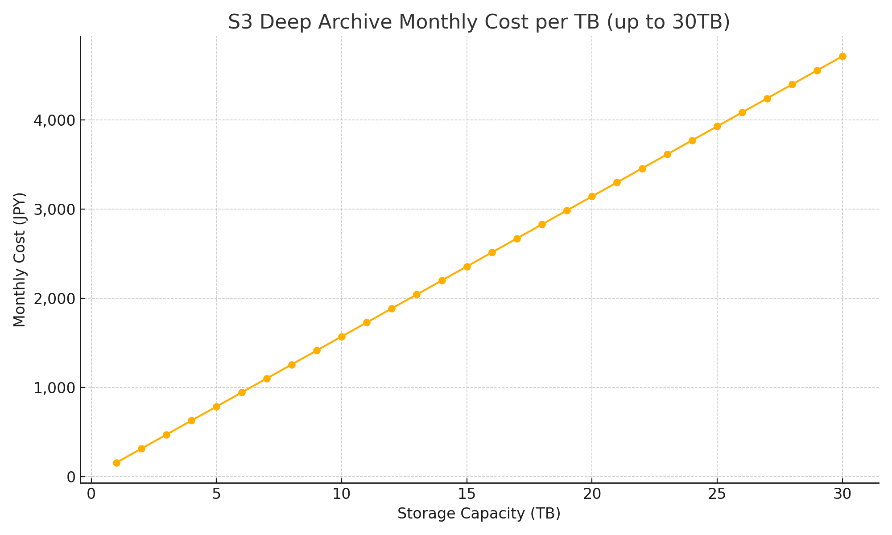

# ReelVault（リールボルト）

ReelVault は、映像制作者が制作済みの映像プロジェクト・素材・納品ファイルを、AWS S3 Deep Archive を活用して安全かつ簡単に長期保管・復元できるデスクトップアプリケーションです。

---

## ✨ 主な特徴

- **あなたのAWSアカウントで安全に**: データはあなた自身のAWSアカウントに保存されるため、管理責任が明確です。
- **圧倒的な低コストで長期保管**: ファイルを置いておくだけで、業界最安クラスのAWS S3 Deep Archiveに自動で送られます。
- **直感的なデスクトップアプリ**: 難しいコマンドは不要。使い慣れたデスクトップアプリで、誰でも簡単に操作できます。
- **macOSに最適化**: macOSのKeychainと統合し、認証情報を安全に管理します。

### 圧倒的な低コスト

ReelVaultは、AWSの非常に安価なストレージ（S3 Glacier Deep Archive）を活用することで、驚異的なコストパフォーマンスを実現します。

下のグラフが示すように、**1TBのデータを1ヶ月間保管するのにかかる費用は、わずか約157円¹** です。

これは、一般的なクラウドストレージサービスと比較して、年間で数万円〜数十万円ものコスト削減に繋がる可能性があります。

#### ⚠️ ご注意：長期保管の性質について

ReelVaultが利用する `AWS S3 Glacier Deep Archive` は、頻繁にアクセスしないデータを非常に安価に保管することに特化したサービスです。そのため、データの取り出し（復元）には、以下の料金と制約があります。

| 取り出しオプション | 取り出し時間（目安） | データ取り出し料金（1GBあたり）¹ |
|:---|:---:|:---:|
| **標準 (Standard)** | 12時間以内 | **約3.4円** ($0.022) |
| **大容量 (Bulk)** | 48時間以内 | **約0.8円** ($0.005) |

- **保管料金とは別に、上記料金とリクエスト料金が発生します。**
- **さらに、インターネットへデータを取り出す際には、1GBあたり約17.7円のデータ転送料金が別途かかります。**

##### 料金例：1TBのデータをダウンロードする場合
例えば、1TBのデータを最も安価な「大容量(Bulk)」オプションで復元し、ダウンロードした場合の料金は以下のようになります。

- **データ取り出し料金:** 1,024GB × 約0.8円/GB = 約820円
- **データ転送料金:** 1,024GB × 約17.7円/GB = 約18,125円
- **合計:** **約18,945円**

このように、保管コストは非常に低い一方、一度に大容量のデータを取り出す際には相応の料金が発生します。このサービスは、編集が完了し、当面使う予定のないプロジェクトの「最終保管庫」としてのご利用が最適です。

<small>¹ 1ドル155円、東京リージョンのS3 Glacier Deep Archiveストレージ料金およびデータ転送料金で計算。</small>

 

## 📥 インストール

> 現在はmacOS版のみ提供しています。

最新のリリースは [こちらのリリース・ページ](https://github.com/CIVICTECH-TV/ReelVault/releases) からダウンロードしてください。

`.dmg`ファイルをダウンロードし、アプリケーションフォルダにドラッグ＆ドロップするだけでインストールは完了です。

## 📖 使い方

詳しい使い方は、[ユーザーマニュアル](docs/user/MANUAL.md)をご覧ください。（現在準備中です）

## 🛠️ 主な技術スタック

- **アプリケーションフレームワーク**: [Tauri](https://tauri.app/) (Rust + React)
- **クラウドストレージ**: AWS S3 (Deep Archive)
- **対応OS**: macOS

## 🤝 コントリビューション

このプロジェクトはオープンソースです。開発に参加したい方は、[開発者ガイド](DEVELOPER_GUIDE.md)をご覧ください。
バグ報告や機能要望は[Issues](https://github.com/CIVICTECH-TV/ReelVault/issues)にお願いします。

## 📄 ライセンス

このプロジェクトは [MIT License](LICENSE) のもとで公開されています。 