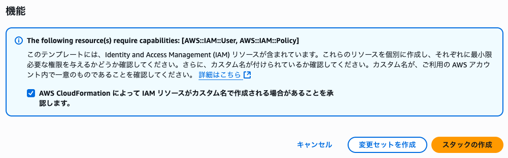
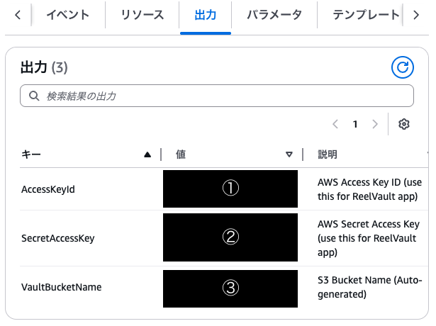
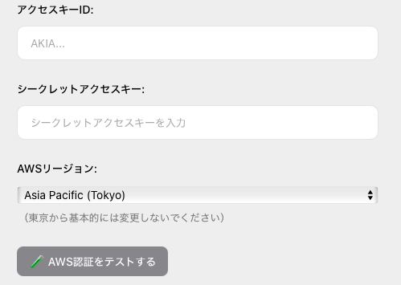
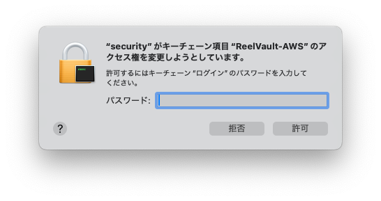
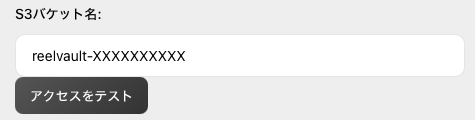
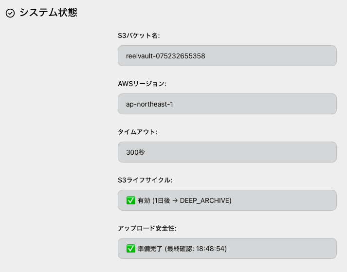

# ReelVault ユーザーマニュアル

このマニュアルは、ReelVaultを初めてお使いになる方向けのガイドです。

## 📥 インストール方法

1.  **アプリケーションのダウンロード**
    -   [最新のリリース・ページ](https://github.com/CIVICTECH-TV/ReelVault/releases)にアクセスします。
    -   お使いのOS（現在はmacOSのみ）に対応した `.dmg` ファイルをダウンロードしてください。

2.  **インストール**
    -   ダウンロードした `.dmg` ファイルを開きます。
    -   ReelVaultのアイコンを 「Applications」 フォルダにドラッグ＆ドロップします。

これでインストールは完了です。LaunchpadなどからReelVaultを起動できます。

---

## ⚠️ 初回起動とAWS設定

ReelVaultを最大限に活用するには、最初にあなた自身のAWSアカウント情報を設定する必要があります。

### なぜAWSアカウントが必要なの？

ReelVaultは、あなたのローカルファイルを、非常に安価で信頼性の高いAmazon Web Services (AWS) のクラウドストレージ（S3 Deep Archive）に保管するためのツールです。データはReelVaultのサーバーではなく、 **あなた自身のAWSアカウント内** に直接保存されます。これにより、完全なデータ所有権を保つことができます。

### セットアップ手順

ReelVaultを利用するために必要なAWSリソース（データ保管用のS3バケットなど）は、簡単なステップで自動的に作成できます。
アプリケーションの指示に従って、以下の手順を進めてください。

#### ステップ1: AWSアカウントの準備

- AWSのアカウントをお持ちでない場合は、[こちら](https://aws.amazon.com/jp/register-service/)から先に作成を済ませてください。

#### ステップ2: CloudFormationでリソースを自動作成

1.  ReelVaultの設定画面に表示されている **「2. 必要なリソースを自動作成するので、ここをクリックしてください。」** のテキストリンク、または以下のボタンをクリックします。
    > **[AWSリソースを自動作成する](https://ap-northeast-1.console.aws.amazon.com/cloudformation/home?region=ap-northeast-1#/stacks/quickcreate?templateURL=https%3A%2F%2Freelvault-template.s3.ap-northeast-1.amazonaws.com%2Freelvault-setup-auto.yaml&stackName=ReelVaultSetup)**
2.  ブラウザでAWSのログイン画面が開きますので、ログインしてください。
3.  「スタックのクイック作成」という画面が表示されます。設定は自動で読み込まれているため、何も変更する必要はありません。
4.  画面を一番下までスクロールし、 **「機能」** セクションにあるチェックボックスをオンにします。

    

    -   **なぜこれが必要なの？**: このテンプレートは、ReelVaultだけが使用する専用のIAMユーザー（プログラムがAWSを操作するための仮想的なユーザー）と、それに対応する最小限の権限（ポリシー）を作成します。これにより、万が一アクセスキーが漏洩しても、被害を最小限に抑えることができます。このチェックボックスは、その安全なリソース作成をあなたが許可した、という証になるのです。
5.  **「スタックの作成」** ボタンをクリックします。
    - これにより、ReelVault専用の安全な設定があなたのAWSアカウントに作成され始めます。

#### ステップ3: 設定情報の取得

1.  スタックの作成が開始されると、ステータスが `CREATE_IN_PROGRESS` と表示されます。完了すると **`CREATE_COMPLETE`** に変わりますので、数分間お待ちください。
    - 進行状況は「イベント」タブで確認できます。

2.  スタックのステータスが `CREATE_COMPLETE` になったら、 **「出力 (Outputs)」** タブを選択します。
    - ここには、ReelVaultアプリケーションの設定に必要な3つの重要な情報が表示されます。

    

    - 以下の値を、右側にあるコピーボタンを使ってそれぞれコピーしてください。
        - **① AccessKeyId**: アプリケーションがAWSに接続するためのIDです。
        - **② SecretAccessKey**: ①のIDに対応するパスワードです。**この値は表示されているこのタイミングでしか確認できませんので、必ずコピーしてください。**
        - **③ VaultBucketName**: あなたのファイルが安全に保管される、クラウド上の保存場所（S3バケット）の名前です。

#### ステップ4: ReelVaultへの設定入力

1.  ReelVaultアプリケーションに戻り、設定画面（⚙️アイコン）を開きます。

    

2.  前のステップでコピーした値を、それぞれ対応するフィールドに貼り付けます。
    - `AWS Access Key ID` → ① `AccessKeyId` の値
    - `AWS Secret Access Key` → ② `SecretAccessKey` の値

3.  `AWS Region` を選択します。
    - これは、あなたがスタックを作成したリージョンと同じである必要があります。（例: `ap-northeast-1` (アジアパシフィック(東京))）
    - わからない場合は、AWSコンソールの右上に表示されているリージョン名を確認してください。

4.  `AWS認証をテストする` ボタンを押します。
    - アクセスキーIDとシークレットアクセスキー、AWSリージョンの組み合わせをテストします。

5.  認証情報を安全に保存するために、macOSがキーチェーンへのアクセス許可を求めるダイアログを表示します。

    

    あなたのMacへのログインパスワードを入力し、 **「許可」** をクリックしてください。これにより、次回以降アプリを起動した際に、認証情報を再入力する手間が省けます。

#### ステップ6: S3バケットの接続

1.  認証情報が保存されると、次にS3バケットへの接続設定が表示されます。

    

2.  `S3バケット名` の入力フィールドに、ステップ3で取得した **③ `VaultBucketName`** の値を貼り付けます。

3.  **「アクセスをテスト」** ボタンをクリックします。
    - 緑色のチェックマークで 「設定完了」 と表示されれば、設定はすべて完了です。

#### ステップ7: 初期設定完了

これで、ReelVaultを使用するためのすべての準備が整いました。あとは、メイン画面からファイルやフォルダをドラッグ＆ドロップするだけで、安全な長期保管庫にコンテンツを保存できます。

## 状態の確認

メイン画面では、いつでも現在のシステム設定を確認できます。

---

*(このマニュアルは現在作成中です。各機能の詳しい使い方については、順次追記していきます。)* 